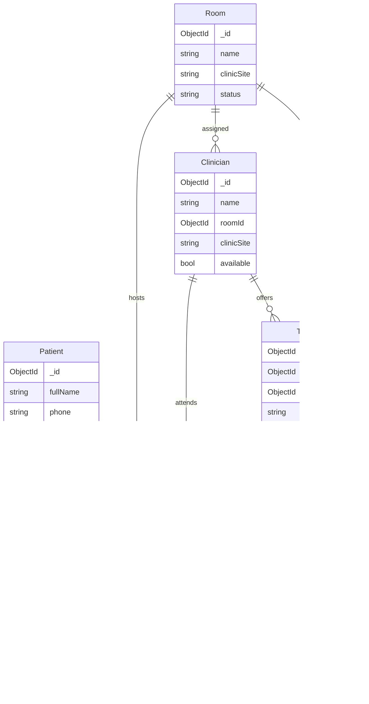

# YɛnCare database architecture

MongoDB + Mongoose for KNUST University Health Services (Students' Clinic and Social Science Block GF7). This is the source of truth for patients, clinicians, rooms, bookable time slots, and appointments. The React prototype's in-memory `ClinicContext` is **not** this store.

MongoDB does not have SQL foreign keys. Integrity is enforced with:

- Mongoose `ObjectId` refs + `populate` helpers
- Pre-save existence checks (when a connection is open)
- Unique compound indexes that prevent double-booking a clinician or room
- Collection JSON Schema validators applied by `npm run db:migrate`

---

## Entity relationship



| Collection | Model | Role |
|---|---|---|
| `patients` | `Patient` | Name, Ghana phone (E.164), optional 8-digit student index, optional NHIS |
| `rooms` | `Room` | Room 1 / Room 2 / GF7, partitioned by `clinicSite` |
| `clinicians` | `Clinician` | Dr. Kwame Boateng, Dr. Ama Serwaa; `roomId` → `Room` |
| `time_slots` | `TimeSlot` | 30-minute offer of a clinician + room on a date |
| `appointments` | `Appointment` | Speakable `YC-XXXX`, status machine, queue fields |

---

## Foreign-key modelling

Every relationship is an `ObjectId` plus `ref`. Routes should use the statics rather than ad-hoc populate:

```js
import { Appointment } from '../src/models/index.js';

const appointment = await Appointment.findByReference('YC-4821');
const queue = await Appointment.populateQueue({
  appointmentDate: '2026-09-15',
  clinicSite: 'students-clinic',
  status: { $in: ['WAITING', 'CALLED'] },
});
```

| Field | Ref | Required | Notes |
|---|---|---|---|
| `Clinician.roomId` | `Room` | Yes | Home consultation room |
| `TimeSlot.clinicianId` | `Clinician` | Yes | Who owns the slot |
| `TimeSlot.roomId` | `Room` | Yes | Where the slot happens |
| `TimeSlot.appointmentId` | `Appointment` | No | Set when booked; cleared on cancel / no-show / delete |
| `Appointment.patientId` | `Patient` | Yes | |
| `Appointment.clinicianId` | `Clinician` | Yes | |
| `Appointment.roomId` | `Room` | Yes | |
| `Appointment.timeSlotId` | `TimeSlot` | No | `null` for emergency walk-ins |

When Mongo is connected, `Appointment` pre-save verifies that those ids exist. Document `deleteOne` and `findOneAndDelete` release the linked time slot.

---

## Double-booking guards

`time_slots` unique compound indexes:

| Index | Prevents |
|---|---|
| `{ clinicianId, date, startTime }` | The same doctor at the same clock time |
| `{ roomId, date, startTime }` | Two consultations in the same room at the same clock time |

A second insert that collides returns Mongo `11000`. Booking routes should map that to the P08 “slot taken” response.

Walk-ins (`bookingType: WALK_IN`) may omit `timeSlotId` so they do not consume a reserved slot.

---

## Appointment status

```
BOOKED → CHECKED_IN → WAITING → CALLED → COMPLETED
    │          │          │         │
    ▼          ▼          ▼         ▼
CANCELLED   CANCELLED   CANCELLED  NO_SHOW
    │                     │
    ▼                     ▼
 NO_SHOW               NO_SHOW
```

New documents may be inserted in any status (seed / import). Updates must follow `STATUS_TRANSITIONS` in `src/db/constants.js`. Audit stamps:

| Status | Timestamp set if empty |
|---|---|
| `CHECKED_IN` / `WAITING` | `checkInTime` |
| `CALLED` | `calledTime` (and `checkInTime` if missing) |
| `COMPLETED` | `completedTime` |
| `CANCELLED` / `NO_SHOW` | `cancelledTime` |

Cancel and no-show also clear `TimeSlot.appointmentId` / `isBooked`.

---

## Speakable reference codes (`YC-XXXX`)

Implemented in `src/utils/referenceCode.js`.

- Default format: `YC-` + 4 digits (`YC-4821`, `YC-7913`).
- Optional speakable alphabet (no `0 1 I O L`) via `charset: 'speakable'`.
- `generateUniqueReferenceCode(existsFn)` retries on collision.
- `allocateReferenceCode(Appointment)` checks the collection when Mongo is connected.
- Appointment `pre('validate')` allocates a code if missing.
- Unique index `appointments_reference_unique` is the last line of defence.

Lookup is by `referenceCode`, not by `_id`, so reception can confirm a code read aloud from SMS.

---

## Index strategy

| Collection | Index | Unique | Why |
|---|---|---|---|
| patients | `phone` | Yes | Identity / SMS destination |
| patients | `studentIndex` | Yes, sparse | Optional KNUST index |
| rooms | `clinicSite + name` | Yes | One “Room 1” per site |
| clinicians | `clinicSite + available` | No | Staff roster filters |
| time_slots | `clinicianId + date + startTime` | Yes | No double-booked doctor |
| time_slots | `roomId + date + startTime` | Yes | No double-booked room |
| time_slots | `date + clinicSite + isBooked` | No | Open-slot queries |
| appointments | `referenceCode` | Yes | SMS / reception lookup |
| appointments | `appointmentDate + clinicSite + status` | No | Daily queue board |
| appointments | `patientId + appointmentDate` | No | “Find my appointment” |
| appointments | `clinicianId + appointmentDate` | No | Clinician day list |

---

## Setup

```bash
cd backend
copy .env.example .env
# set MONGODB_URI if not using mongodb://127.0.0.1:27017/yencare
npm install
npm run db:migrate:dry      # print planned collections/indexes (no Mongo required)
npm run db:migrate          # idempotent collections + validators + indexes
npm run db:seed             # KNUST rooms, doctors, 2026-09-15 demo day
npm test
```

`db:migrate` and `db:seed` are safe to re-run. Seed upserts by phone, room name + site, clinician name, slot (clinician + date + start), and `referenceCode`.

### Environment

| Variable | Default | Purpose |
|---|---|---|
| `MONGODB_URI` | `mongodb://127.0.0.1:27017/yencare` | Database connection |

---

## Booking write path (Able / Emmanuella)

1. Upsert `Patient` (normalised `+233…` phone).
2. Find a free `TimeSlot` (`isBooked: false`).
3. Insert `Appointment` (code allocated if omitted). Unique slot indexes reject races.
4. Time-slot post-save sets `isBooked` + `appointmentId`.
5. Return HTTP 201 + `referenceCode` to the web client.
6. Call `sendSms()` — booking stays valid if SMS fails.

---

## Source map

| Path | Responsibility |
|---|---|
| `src/db/connection.js` | Pool, reconnect logs, graceful shutdown |
| `src/db/constants.js` | Enums, date/time/code regexes, status transitions |
| `src/db/collections.js` | JSON Schema validators + index specs |
| `src/models/*.js` | Mongoose models and hooks |
| `src/utils/referenceCode.js` | `YC-XXXX` generator |
| `scripts/migrate.js` | `npm run db:migrate` |
| `scripts/seed.js` | `npm run db:seed` |
