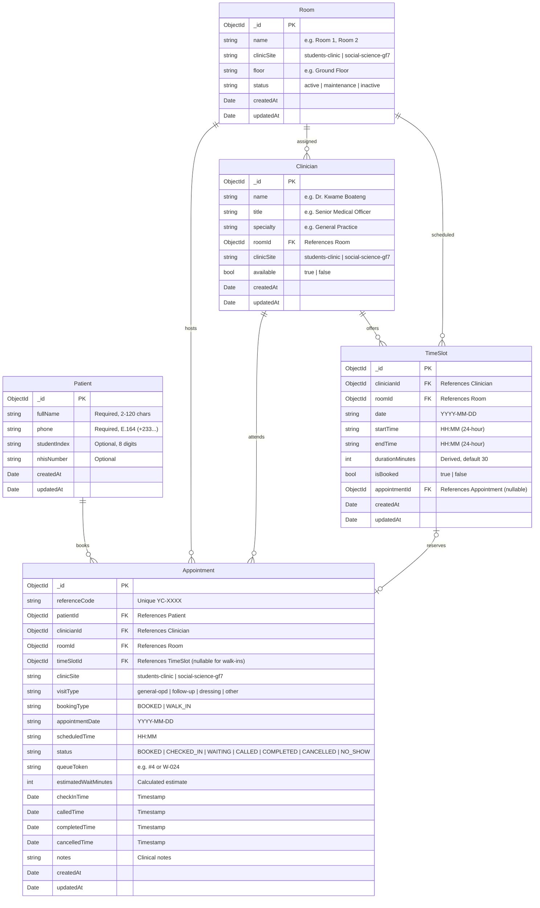

# Database Architecture & Schema Specification

> **MongoDB & Mongoose Data Model for YɛnCare Platform**

---

## 1. Overview & Data Philosophy

The YɛnCare persistence layer is implemented in **MongoDB 7** using **Mongoose 8** and native MongoDB collection specifications. It models operations for KNUST University Health Services (Students' Clinic and Social Science Block GF7).

### Relational Integrity in a Document Database
Because MongoDB does not provide native SQL foreign-key constraints, referential integrity and consistency are enforced through:
1. **Mongoose `ObjectId` References & Schema Hooks**: Pre-save existence checks ensure that referenced patient, clinician, room, and timeslot records exist before an appointment is written.
2. **Unique Compound Indexes**: Strict MongoDB engine-level unique indexes prevent double-booking a doctor or a room at the exact same clock time.
3. **Cascading Lifecycle Hooks**: When an appointment is cancelled, marked as a no-show, or deleted, Mongoose middleware automatically releases the associated `TimeSlot` (`isBooked: false`, `appointmentId: null`).
4. **JSON Schema Validators**: Formal collection validators enforced via `scripts/migrate.js` guarantee valid field types and regex patterns at the database layer.

---

## 2. Entity Relationship Diagram



---

## 3. Collections & Schema Details

### 3.1 `patients`
Stores registered students and walk-in patients.

| Field | Type | Required | Constraints / Validation | Description |
|---|---|---|---|---|
| `_id` | `ObjectId` | Auto | Primary key | Unique record ID |
| `fullName` | `String` | Yes | Min 2, max 120 chars | Patient's full name |
| `phone` | `String` | Yes | E.164 Ghana format (`^\+233[0-9]{9}$`) | Unique index. Sanitized Ghana phone |
| `studentIndex` | `String` | No | 8 digits (`^[0-9]{8}$`) | Unique sparse index. KNUST index number |
| `nhisNumber` | `String` | No | Trimmed string | Optional National Health Insurance number |
| `createdAt` | `Date` | Auto | Mongoose timestamp | Registration timestamp |
| `updatedAt` | `Date` | Auto | Mongoose timestamp | Last profile update timestamp |

**Indexes**:
- `patients_phone_unique`: `{ phone: 1 }` (Unique)
- `patients_studentIndex_unique`: `{ studentIndex: 1 }` (Unique, Sparse)

---

### 3.2 `rooms`
Physical examination and consultation rooms.

| Field | Type | Required | Constraints | Description |
|---|---|---|---|---|
| `name` | `String` | Yes | Trimmed string | Room label (e.g., `Room 1`, `Room 2`, `Consultation Room GF7`) |
| `clinicSite` | `String` | Yes | Enum: `students-clinic`, `social-science-gf7` | Healthcare facility partition |
| `floor` | `String` | No | Default: `Ground Floor` | Floor location |
| `status` | `String` | Yes | Enum: `active`, `maintenance`, `inactive` | Operational state |

**Indexes**:
- `rooms_site_name_unique`: `{ clinicSite: 1, name: 1 }` (Unique)

---

### 3.3 `clinicians`
Attending medical doctors and clinical officers.

| Field | Type | Required | Constraints | Description |
|---|---|---|---|---|
| `name` | `String` | Yes | Min 2, max 120 chars | Clinician name (e.g., `Dr. Kwame Boateng`) |
| `title` | `String` | Yes | Default: `Medical Officer` | Professional title |
| `specialty` | `String` | Yes | Default: `General Practice & Outpatient` | Medical specialty |
| `roomId` | `ObjectId` | Yes | Ref: `Room` | Primary assigned consultation room |
| `clinicSite` | `String` | Yes | Enum: `students-clinic`, `social-science-gf7` | Clinic location |
| `available` | `Boolean` | Yes | Default: `true` | Duty availability flag |

**Indexes**:
- `clinicians_site_available`: `{ clinicSite: 1, available: 1 }`
- `clinicians_room`: `{ roomId: 1 }`

---

### 3.4 `time_slots`
Bookable calendar consultation intervals.

| Field | Type | Required | Constraints | Description |
|---|---|---|---|---|
| `clinicianId` | `ObjectId` | Yes | Ref: `Clinician` | Clinician offering the slot |
| `roomId` | `ObjectId` | Yes | Ref: `Room` | Room where consultation takes place |
| `date` | `String` | Yes | Format: `YYYY-MM-DD` | Calendar date |
| `startTime` | `String` | Yes | Format: `HH:MM` | Slot start time |
| `endTime` | `String` | Yes | Format: `HH:MM` (must be > startTime) | Slot end time |
| `durationMinutes` | `Number` | Yes | Default: `30` | Derived consultation duration |
| `isBooked` | `Boolean` | Yes | Default: `false` | Booking reservation flag |
| `appointmentId` | `ObjectId` | No | Ref: `Appointment` | Linked appointment ID |

**Indexes**:
- `timeslots_clinician_datetime_unique`: `{ clinicianId: 1, date: 1, startTime: 1 }` (Unique)
- `timeslots_room_datetime_unique`: `{ roomId: 1, date: 1, startTime: 1 }` (Unique)
- `timeslots_day_availability`: `{ date: 1, isBooked: 1, clinicianId: 1 }`

> [!IMPORTANT]
> The unique indexes on `{ clinicianId, date, startTime }` and `{ roomId, date, startTime }` guarantee at the database engine level that neither a doctor nor a consultation room can ever be double-booked at the same time.

---

### 3.5 `appointments`
The central appointment and queue transaction document.

| Field | Type | Required | Constraints | Description |
|---|---|---|---|---|
| `referenceCode` | `String` | Yes | Unique regex `^YC-[0-9]{4}$` | Speakable reference code |
| `patientId` | `ObjectId` | Yes | Ref: `Patient` | Patient booking the visit |
| `clinicianId` | `ObjectId` | Yes | Ref: `Clinician` | Attending clinician |
| `roomId` | `ObjectId` | Yes | Ref: `Room` | Consultation room |
| `timeSlotId` | `ObjectId` | No | Ref: `TimeSlot` (null for walk-ins) | Reserved calendar slot |
| `clinicSite` | `String` | Yes | Enum: `students-clinic`, `social-science-gf7` | Clinic location |
| `visitType` | `String` | Yes | Enum: `general-opd`, `follow-up`, `dressing`, `other` | Clinical category |
| `bookingType` | `String` | Yes | Enum: `BOOKED`, `WALK_IN` | Appointment origin |
| `appointmentDate` | `String` | Yes | Format: `YYYY-MM-DD` | Scheduled visit date |
| `scheduledTime` | `String` | Yes | Format: `HH:MM` | Scheduled visit time |
| `status` | `String` | Yes | Enum (see Section 4) | Lifecycle state |
| `queueToken` | `String` | No | e.g., `#4` or `W-024` | Live queue display token |
| `estimatedWaitMinutes`| `Number` | No | Integer | Dynamic wait calculation |
| `checkInTime` | `Date` | No | Set on check-in | Arrival timestamp |
| `calledTime` | `Date` | No | Set when doctor calls patient | Consultation call timestamp |
| `completedTime` | `Date` | No | Set when consultation ends | Completion timestamp |
| `cancelledTime` | `Date` | No | Set on cancel/no-show | Cancellation timestamp |

**Indexes**:
- `appointments_reference_unique`: `{ referenceCode: 1 }` (Unique)
- `appointments_day_site_status`: `{ appointmentDate: 1, clinicSite: 1, status: 1 }`
- `appointments_patient_date`: `{ patientId: 1, appointmentDate: -1 }`
- `appointments_clinician_date`: `{ clinicianId: 1, appointmentDate: 1 }`
- `appointments_timeslot`: `{ timeSlotId: 1 }` (Sparse)

---

## 4. Appointment Status Transitions

Allowed transitions are strictly validated in `src/db/constants.js`:

```text
BOOKED ──────► CHECKED_IN ──────► WAITING ──────► CALLED ──────► COMPLETED
  │                 │                │               │
  ├─────────────────┼────────────────┴───────────────┼─────────► NO_SHOW
  │                 │                                │
  ▼                 ▼                                ▼
CANCELLED        CANCELLED                        CANCELLED
```

### Transition Audit Rules
- Moving to `CHECKED_IN` or `WAITING` stamps `checkInTime`.
- Moving to `CALLED` stamps `calledTime` (and backfills `checkInTime` if missing).
- Moving to `COMPLETED` stamps `completedTime`.
- Moving to `CANCELLED` or `NO_SHOW` stamps `cancelledTime` and executes a pre-hook to clear `TimeSlot.isBooked` and `TimeSlot.appointmentId`.

---

## 5. Database Scripts & Commands

| Command | Script File | Action |
|---|---|---|
| `npm run db:migrate` | `backend/scripts/migrate.js` | Applies collection validators and ensures all unique and compound indexes |
| `npm run db:migrate:dry` | `backend/scripts/migrate.js --dry-run` | Verifies index definitions and conflicts without writing to MongoDB |
| `npm run db:seed` | `backend/scripts/seed.js` | Seeds rooms, clinicians, sample patients, and September 15 2026 demo schedule |
| `npm run db:seed:dry` | `backend/scripts/seed.js --dry-run` | Verifies seed document payloads without connecting to MongoDB |
