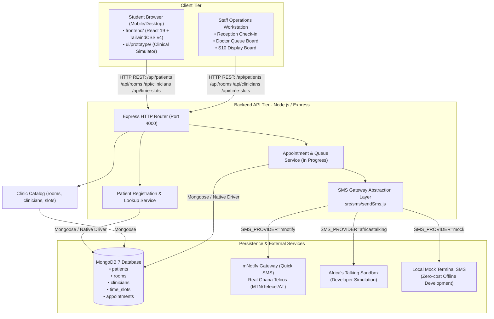

# System Architecture Overview

> **Technical Architecture & System Topology for YɛnCare**

---

## 1. Executive Architecture Summary

YɛnCare is designed specifically for outpatient campus healthcare facilities in Ghana, with initial deployment modeled on **KNUST University Health Services · Students' Clinic (Main Campus)** and its satellite consultation post at **Social Science Block GF7**.

The architecture balances two critical realities:
1. **Low Friction for Patients**: Students must be able to book, look up appointments, and track their position in a live queue over standard mobile browsers without remembering usernames or passwords, and even under erratic campus mobile data connectivity.
2. **Deterministic Clinical Operations**: Clinic receptionists and medical doctors need an operational workstation that guarantees patient order, prevents double-booking rooms or clinicians, accommodates walk-ins gracefully, and provides clear visibility of waiting corridors.

---

## 2. Multi-Tier System Topology

---

## 3. Core Architectural Components

### 3.1 Public Frontend Client (`frontend/`)
- **Technology**: React 19, React Router v7/v8, Axios, TailwindCSS v4, Vite.
- **Role**: Clean, lightweight web application providing student landing, appointment booking UI, queue checking, and staff portal access.
- **API Integration**: Talks to `backend` through centralized Axios instance configured via `VITE_API_BASE_URL` (default: `http://localhost:4000/api`).
- **Services & Hooks**:
  - `src/services/patients.js`: Handles `registerPatient()` (`POST /api/patients`).
  - `src/services/appointments.js`: Client abstraction for booking creation and management.
  - `src/hooks/useApiRequest.js`: Reusable hook managing async `idle` / `loading` / `success` / `error` lifecycle.
  - `src/components/booking/`: 4-step interactive booking flow (`BookingForm`, `WelcomeForm`, `PersonalDetails`, `ClinicSelection`, `ServiceSelection`) with patient registration.

### 3.2 Interactive Clinical Prototype & Simulator (`ui/prototype/`)
- **Technology**: React 19, TypeScript, Vite, TailwindCSS v4, Custom Design Tokens.
- **Role**: Complete, pixel-accurate clinical simulation hub used for UX validation, clinical stakeholder walkthroughs, and end-to-end edge-case testing.
- **State Management**: Centralized reactive state machine (`ClinicContext.tsx`) managing in-memory seeded rosters, live queue progression, SMS modal viewer, network connectivity toggles, and staff role switching.
- **Includes**:
  - 19 patient screens (P01 through P19).
  - 11 clinical operations screens (S01 through S10).
  - Prototype Toolbar (`ProtoToolbar`) for instant state stepping and edge scenario injection.

### 3.3 Backend API Server (`backend/`)
- **Technology**: Node.js 18+, Express 4, Mongoose 8, Native MongoDB Node Driver.
- **Role**: Authoritative REST API service handling patient records, appointment scheduling, double-booking prevention, database migrations, and outbound SMS notifications.
- **Architecture**:
  - `src/server.js`: Process entry point, connects to MongoDB, starts HTTP listener on `PORT` (default: `4000`).
  - `src/http/app.js`: Express app assembly, CORS configuration, body parsing (32kb limit), error handling middleware.
  - `src/http/patientsRoutes.js`: Controller layer for `/api/patients`.
  - `src/http/catalogRoutes.js`: Read-only `/api/rooms`, `/api/clinicians`, `/api/time-slots` for booking ObjectIds.
  - `src/patients/service.js`: Domain service coordinating validation, normalization, and persistence.
  - `src/patients/fields.js`: Shared `phone` / `phoneNumber` and NHIS alias resolution so SMS and `Appointment.populate()` never read `undefined`.
  - `src/models/`: Formal Mongoose models (`Patient`, `Clinician`, `Room`, `TimeSlot`, `Appointment`).
  - `src/sms/`: Unified SMS sending engine (`sendSms.js`) supporting multiple delivery backends.

### 3.4 Persistence Layer (MongoDB 7)
- **Local Runtime**: Docker Compose configuration (`docker compose up -d`) running official `mongo:7` image with persistent volume `yencare_mongo`.
- **Cloud Runtime**: MongoDB Atlas compatible via `MONGODB_URI` connection string.
- **Integrity**: Enforced via Mongoose Schema rules, pre-save reference validation, unique compound indexes, and explicit JSON Schema validators managed by migration scripts (`npm run db:migrate`).

### 3.5 Outbound SMS Gateway
- **Single Abstraction**: Single entry point `sendSms(to, message)`.
- **Decoupled Delivery**: API responses return immediately to the patient with booking confirmation; SMS is dispatched asynchronously so that third-party telco downtime never blocks a confirmed booking.

---

## 4. Key Architectural Decisions (ADRs)

### ADR 1: Password-Free Authentication via Identity Triad
- **Context**: In Ghanaian campus clinics, students frequently abandon portals requiring password registration, recovery emails, or SMS OTPs during intermittent cellular data connectivity.
- **Decision**: Students identify using their **Full Name**, **8-digit KNUST Student Index Number** (`20612345`), and **Ghana Mobile Phone Number** (`+233...`).
- **Lookups**: Bookings are retrieved using either the student index number or the telephone number paired with the speakable reference code (`YC-4821`).
- **Consequences**: Zero signup barrier, instantaneous booking, verified by receptionists during physical in-person check-in.

### ADR 2: Speakable Reference Codes (`YC-XXXX`)
- **Context**: High-entropy UUIDs or long alphanumeric codes (`9b1deb4d-3b7d-4bad-9bdd-2b0d7b3dcb6d`) are impossible for patients to read over reception desks or remember from an SMS.
- **Decision**: Generate formatted, 4-digit numeric reference codes prefixed by clinic initials (`YC-4821`). For front-desk unscheduled walk-ins, allocate daily walk-in tokens (`W-024`).
- **Consequences**: Easy oral communication at reception desks, clear identification on waiting corridor display boards.

### ADR 3: Asynchronous SMS Dispatch with Resilient Fallback
- **Context**: Third-party SMS gateways and regional mobile networks in West Africa can experience latency spikes, balance exhaustion, or intermittent delivery failures.
- **Decision**: The booking transaction is committed to MongoDB and confirmed to the web client first. Outbound SMS failures are logged, but do not roll back the appointment. The web screen acts as the authoritative confirmation of record.
- **Fallback**: In development and test environments, `SMS_PROVIDER=mock` outputs directly to stdout, eliminating external costs and internet dependencies.

### ADR 4: Clinical Brutalism Design System
- **Context**: Medical apps with excessive ornamentation, heavy gradients, or delicate low-contrast text suffer poor readability in bright outdoor sunlight or on budget smartphones.
- **Decision**: Adopt a high-contrast editorial minimalism dubbed "Clinical Brutalism" featuring a clean palette (`#111111`, `#F7F8F7`, `#087F6C`, `#E7F5F1`), crisp typography (Hanken Grotesk), high-contrast borders (`#D8DCD9`), and accessible touch targets (minimum 44x44px).
