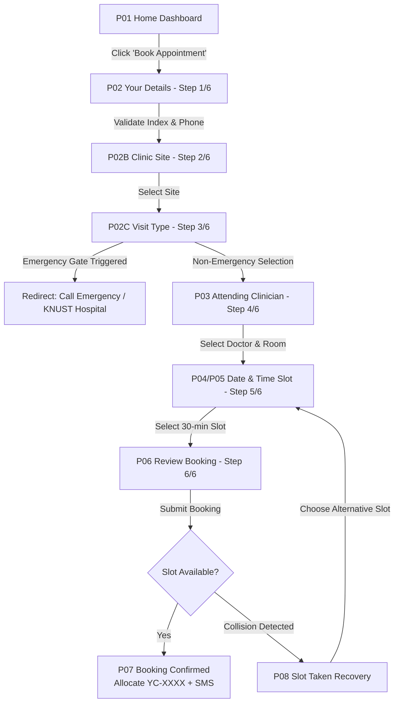
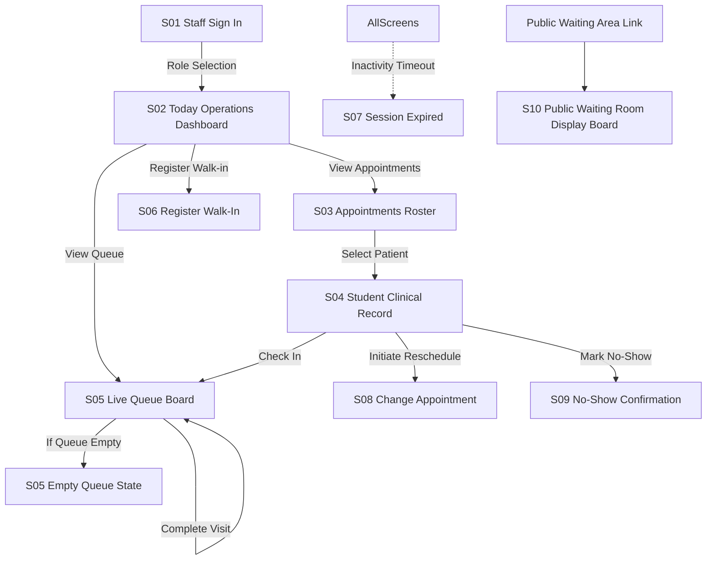

# Queue & Appointment State Machines

> **Lifecycle, Token Allocation, and Navigation State Machines for YɛnCare**

---

## 1. Patient Experience Lifecycle (Shell 1)

The student journey is designed as a focused, linear web wizard with explicit recovery branches for edge cases.

### 1.1 Booking Flow (6-Step Funnel)

### 1.2 Screen Descriptions (Patient Web)

| Screen ID | Title | Purpose & User Actions | Key Outputs / Form State |
|---|---|---|---|
| **P01** | Home Dashboard | Welcome landing, live clinic status summary, immediate action cards | CTAs: "Book appointment", "Find appointment", "Check clinic activity" |
| **P02** | Your Details (Step 1/6) | Collect student identification without requiring a password | `fullName`, `studentIndex` (8 digits), `phone` (+233), optional `nhisNumber` |
| **P02B** | Clinic Site (Step 2/6) | Choose between campus facilities | `students-clinic` (Main Campus) or `social-science-gf7` |
| **P02C** | Visit Type (Step 3/6) | Clinical categorization with safety gate | `general-opd`, `follow-up`, `dressing`, or `other`. Emergency symptoms display red emergency guidance |
| **P03** | Attending Clinician (Step 4/6) | Doctor selection with room alignment | **Dr. Kwame Boateng · Room 1** or **Dr. Ama Serwaa · Room 2** |
| **P04/P05** | Date & Time Slot (Step 5/6) | Date selector & 30-minute consultation slot | Date picker + slot selector with "Arrive 15 min early" guidance |
| **P06** | Review Booking (Step 6/6) | Summary table of details before commitment | Full key-value summary + SMS notification disclosure |
| **P07** | Booking Confirmed | Success card with speakable reference | Displays **`YC-4821`**, calendar details, arrive-by advisory, simulated SMS preview |
| **P08** | Slot Taken | Slot conflict recovery | Displays conflict notice with quick return to pick another slot |
| **P09** | Find Appointment | Lookup hub for existing appointments | Tabbed search by Student Index Number, `YC-` Reference, or Phone |
| **P10** | Clinic Activity | Real-time pre-check-in clinic intelligence | Active doctors on duty, waiting counts, estimated wait, clinic notices |
| **P11** | Appointment Details Hub | Patient self-service management | View status badge, staff reschedule notices, SMS history, Reschedule/Cancel CTAs |
| **P12** | Cancel Confirmation | Cancellation prompt | Prompts patient to confirm slot release to free capacity for peers |
| **P13** | Appointment Cancelled | Cancellation complete | Confirms slot release and offers to rebook if needed |
| **P14–P17**| Reschedule Flow | 3-step date/time modification | Pick new date (P14), new time (P15), comparison review (P16), updated confirmation (P17) |
| **P18** | Live Virtual Queue Status | 5-stage live tracker with token | Displays queue position (`#4`), estimated wait, room call banner |
| **P19** | After-Hours Notice | Clinic closed state | Operating hours schedule (Mon-Fri 08:00–17:00) and urgent care hospital guidance |

---

## 2. Staff Clinical Operations Portal (Shell 2)

Staff members access an operational workstation designed for fast, single-click execution.

### 2.1 Staff Screen Catalog

| Screen ID | Title | Role & Responsibility |
|---|---|---|
| **S01** | Staff Sign In | Rapid role switcher (`Receptionist`, `Doctor`, `Admin`) for demonstration and workstation login |
| **S02** | Today Operations Dashboard | High-level clinical command center with real-time metrics (Total Patients, Waiting, In Consult, Completed, Walk-Ins, No-Shows) |
| **S03** | Appointments Roster | Searchable, filterable table of today's booked patients, walk-ins, and checked-in students |
| **S04** | Student Clinical Record | Detailed dossier showing student index, phone, NHIS, clinic site, and multi-room dispatch actions |
| **S05** | Live Queue Board | Dual-room split board (Room 1 & Room 2) with active consultation banners and one-click `Call` & `Complete` buttons |
| **S05E** | Empty Queue State | Clean status view when no students are currently in the waiting corridor |
| **S06** | Register Walk-In | Reception interface to register students arriving without a prior booking, issuing `W-XXX` tokens directly to queue |
| **S07** | Session Expired | Workstation security timeout modal with instant re-authentication |
| **S08** | Change Appointment | Staff-driven reschedule tool requiring clinical reason input and triggering student SMS alert |
| **S09** | Mark No-Show | Two-step confirmation dialog to release missed appointments and free clinical capacity |
| **S10** | Public Waiting Room Display Board | Full-screen corridor display view showing currently called tokens and room assignments for waiting room TVs |

---

## 3. Reference Codes & Queue Token Architecture

YɛnCare employs two complementary identification token systems:

### 3.1 Speakable Appointment References (`YC-XXXX`)
- **Format**: `YC-` followed by exactly 4 digits (e.g., `YC-4821`, `YC-9104`).
- **Generation**: Generated on initial web booking via `src/utils/referenceCode.js`.
- **Purpose**: Permanent identifier used by the student for lookup, reschedule, oral reception verification, and SMS confirmation.
- **Uniqueness**: Enforced via MongoDB unique index `appointments_reference_unique`.

### 3.2 Live Queue Tokens (`#X` and `W-XXX`)
- **Scheduled Appointments**: Upon reception check-in, scheduled students receive a sequential position token (e.g., `#1`, `#2`, `#3`, `#4`).
- **Unscheduled Walk-Ins**: Front-desk walk-in students receive an explicit walk-in prefix token (e.g., `W-024`, `W-025`) to distinguish them visually from booked appointments on the staff roster and the S10 Public Waiting Room Display Board.

---

## 4. Resilience & Network Recovery (G01)

When a patient experiences total cellular disconnection or network failure while checking their status:
- The web app intercepts offline state and renders screen **G01 (Network Recovery)**.
- G01 displays previously cached appointment details and the speakable reference code **`YC-4821`** from local browser storage.
- A prominent "Try Again" CTA allows instant reconnect retry when mobile signal is re-established.
