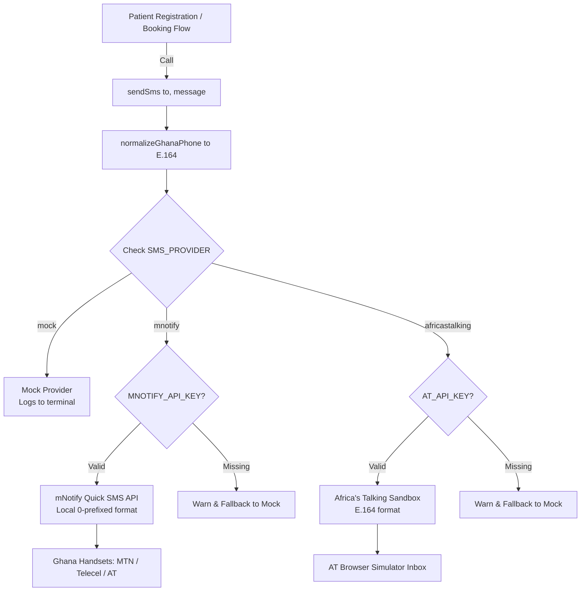

# SMS Gateway & Provider Operations Manual

> **Outbound SMS Notification Architecture, Ghana Telco Providers & Fallback Engine**

---

## 1. Overview & Architecture

The YɛnCare outbound SMS subsystem sends booking confirmations, reminder notifications, and appointment change alerts to Ghanaian mobile subscribers across all major telecommunications networks (**MTN Ghana**, **Telecel Ghana**, and **AT Ghana**).

The SMS engine is designed around three principles:
1. **Single Unified Abstraction**: All routes import `sendSms(to, message)` from `src/sms/sendSms.js`. No route directly invokes an external vendor SDK or HTTP endpoint.
2. **Asynchronous Non-Blocking Execution**: Web booking confirmation is the authoritative source of record. If an SMS fails to deliver due to carrier latency or insufficient vendor credits, the booking remains valid.
3. **Multi-Provider Fallback**: The engine switches smoothly between local mock logs, live mNotify delivery, and Africa's Talking developer sandboxes.



---

## 2. API Contract

```typescript
sendSms(to: string, message: string): Promise<SmsResult>
```

### Parameters
- `to` (`string`, required): Ghana phone number. Accepts local zero-prefixed (`0241234567`), space-delimited (`024 123 4567`), international without plus (`233241234567`), or standard E.164 (`+233241234567`).
- `message` (`string`, required): Text message body. Standard SMS is 160 characters (longer messages are segmented by carriers).

### Return Interface (`SmsResult`)
```typescript
interface SmsResult {
  ok: boolean;
  provider: 'mock' | 'mnotify' | 'africastalking';
  id?: string;        // Vendor message ID or mock ID
  to: string;         // Normalized E.164 phone
  error?: string;     // Description if ok is false
}
```

---

## 3. Supported Delivery Modes

| Provider | `SMS_PROVIDER` | Credentials Needed | Delivery Target | Cost |
|---|---|---|---|---|
| **Mock** | `mock` | None | Local terminal (`stdout`) | Free |
| **mNotify** | `mnotify` | `MNOTIFY_API_KEY`<br>`MNOTIFY_SENDER_ID` | Real Ghana mobile phones | Free trial units / Paid credits |
| **Africa's Talking** | `africastalking` | `AT_API_KEY`<br>`AT_USERNAME=sandbox` | AT Web Simulator Inbox | Free |

---

## 4. Operational Setup: mNotify (Live Ghana SMS)

mNotify ([mnotify.com](https://www.mnotify.com/)) is the primary provider for sending real SMS to physical mobile devices in Ghana.

### Step 1: Create an Account
1. Register at [mnotify.com](https://www.mnotify.com/). New accounts receive free trial SMS units.
2. Log into the mNotify dashboard.

### Step 2: Generate API v2 Key
1. In the dashboard, open your account profile menu.
2. Navigate to **API v2** &rarr; **Create API Key**.
3. Copy the generated key.

### Step 3: Register Sender ID
1. Navigate to **Sender ID** in the mNotify dashboard.
2. Request a new sender ID: **`YenCare`** (maximum 11 alphanumeric characters).
3. Note: In Ghana, telcos require sender IDs to be vetted. Until approved, messages may send under a default sender or require testing with approved trial IDs.

### Step 4: Configure `backend/.env`
Add your credentials to `backend/.env`:
```env
SMS_PROVIDER=mnotify
MNOTIFY_API_KEY=your_actual_mnotify_api_key
MNOTIFY_SENDER_ID=YenCare
```

### Step 5: Test Live SMS Delivery
Run the included test script to send a real SMS to your personal Ghana phone number:

```bash
npm run sms:test -- +233241234567
```

Confirm that the SMS arrives on the handset, and check the delivery receipt in your mNotify dashboard.

---

## 5. Operational Setup: Africa's Talking Sandbox

For team members without access to a physical Ghana handset:

1. Sign up at [africastalking.com](https://account.africastalking.com/apps/sandbox).
2. Generate an API Key under the **Sandbox** application.
3. Configure `backend/.env`:
   ```env
   SMS_PROVIDER=africastalking
   AT_USERNAME=sandbox
   AT_API_KEY=your_sandbox_api_key
   ```
4. Test delivery to the simulator:
   ```bash
   npm run sms:test -- +233241234567
   ```
5. View the incoming message in the [Africa's Talking Web Simulator](https://simulator.africastalking.com:1517/).

---

## 6. Troubleshooting Common Issues

| Symptom | Cause | Solution |
|---|---|---|
| `[sms] SMS_PROVIDER=mnotify but MNOTIFY_API_KEY is missing` | Empty environment variable | Check `backend/.env` and ensure `MNOTIFY_API_KEY` is populated. |
| mNotify returns `401 Unauthorized` | Old v1 key or invalid key | Ensure the key was created under **API v2** on the mNotify dashboard. |
| mNotify returns `400` with Sender ID error | Sender ID not yet approved by telcos | Register `YenCare` on the dashboard or temporarily use an approved default ID. |
| `Invalid Ghana phone number` | Number format rejected | Provide a valid 10-digit local number (`0241234567`) or international format (`+233241234567`). |
| Recipient received no SMS | Insufficient credits or carrier DND | Check remaining SMS balance in mNotify dashboard; verify handset is not on Do-Not-Disturb list. |
