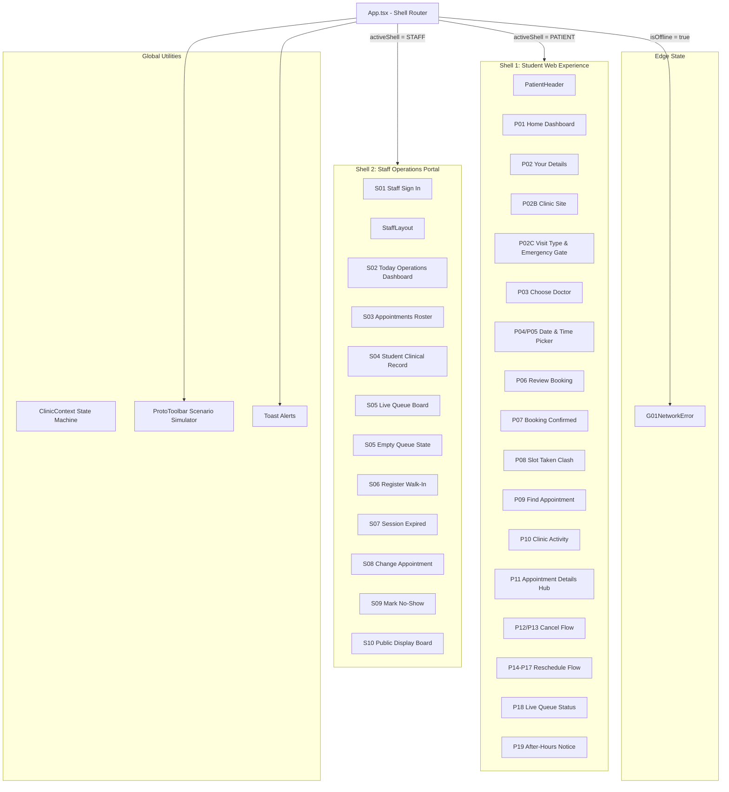

# YɛnCare — UI Architecture & Technical Specification

> **Interactive Web Application Architecture, Component Hierarchy & Screen State Machines**  
> Tailored for **KNUST University Health Services · Students' Clinic** and **Social Science Block GF7**.

---

## 1. System Overview

The YɛnCare UI architecture is designed as a unified application supporting two distinct operational shells:
1. **Student Web Experience (`Shell 1`)**: Frictionless 6-step appointment booking, tabbed student lookup, real-time pre-check-in clinic intelligence, and live virtual queue monitoring without mandatory passwords.
2. **Staff Clinical Operations Portal (`Shell 2`)**: Workstation for receptionists, doctors, and clinic administrators to check in students, manage multi-room consultation queues, register walk-ins, and broadcast to public waiting area display boards.
3. **Clinical Brutalism Design System**: High-contrast, structured, editorial minimalism optimized for legibility under bright Ghanaian sunlight, low cognitive load, and accessibility on standard mobile web browsers.

---

## 2. Component Hierarchy & Shell Routing



---

## 3. State Management (`ClinicContext`)

All client-side state is centrally orchestrated by `ClinicContext` (`src/context/ClinicContext.tsx`):

### Core State Fields

| State Property | Type | Description |
|---|---|---|
| `activeShell` | `'PATIENT' \| 'STAFF'` | Currently displayed shell |
| `patientScreen` | `PatientScreen` | Active patient screen enum (`P01_HOME` ... `P19_AFTER_HOURS`) |
| `staffScreen` | `StaffScreen` | Active staff screen enum (`S01_SIGN_IN` ... `S10_DISPLAY_BOARD`) |
| `appointments` | `Appointment[]` | Active list of clinic appointments |
| `draftBooking` | `DraftBooking` | Temporary wizard state for new student booking |
| `rescheduleDraft`| `RescheduleDraft`| Temporary state for appointment rescheduling |
| `activePatientAppointmentId` | `string` | ID of patient viewing their details (default: `YC-4821`) |
| `selectedStaffAppointmentId` | `string` | ID of patient selected in staff roster |
| `staffUser` | `StaffUser` | Active staff profile (Receptionist / Doctor / Admin) |
| `connectivity` | `ConnectivityState` | Network simulation state (`online`, `poor`, `offline`, `restored`) |
| `isSessionExpired` | `boolean` | Flag triggering S07 session timeout modal |
| `simulateSlotTaken` | `boolean` | Flag triggering P08 slot conflict recovery on submit |

---

## 4. Canonical Data Models (`src/types/clinic.ts`)

### 4.1 `Appointment`
```typescript
interface Appointment {
  id: string;                    // Speakable reference code e.g. "YC-4821" or "W-024"
  patientName: string;           // Full name e.g. "Akosua Boateng"
  phone: string;                 // Ghana phone e.g. "024 123 4567"
  studentIndex?: string;         // 8-digit KNUST index e.g. "20612345"
  nhisNumber?: string;           // Optional NHIS card number
  doctor: Doctor;                // Attending clinician profile
  date: string;                  // Formatted date e.g. "Tuesday 15 September 2026"
  time: string;                  // Consultation time e.g. "9:30 AM"
  status: AppointmentStatus;     // 'BOOKED' | 'CHECKED_IN' | 'WAITING' | 'CALLED' | 'COMPLETED' | 'CANCELLED' | 'NO_SHOW'
  clinicSite: ClinicSite;        // 'students-clinic' | 'social-science-gf7'
  visitType: VisitType;          // 'general-opd' | 'follow-up' | 'dressing' | 'other'
  bookingType: BookingType;      // 'BOOKED' | 'WALK_IN'
  queueToken?: string;           // e.g. "#4" or "W-024"
  estimatedWaitMinutes?: number; // Estimated wait in corridor
  room?: string;                 // Assigned consultation room (e.g. "Room 1")
  assignedRoom?: string;         // Room confirmed when patient is called
  createdAt?: string;            // Timestamp
  notes?: string;                // Clinical triage notes
  staffChangeReason?: string;    // Reason if staff rescheduled
  staffChangedTime?: string;     // Previous time before staff change
}
```

### 4.2 `Doctor`
```typescript
interface Doctor {
  id: string;
  name: string;                  // "Dr. Kwame Boateng"
  title: string;                 // "Senior Medical Officer"
  specialty: string;             // "General Practice & Outpatient"
  room: string;                  // "Room 1"
  available: boolean;            // Duty status
}
```

---

## 5. Screen Navigation & State Machines

### 5.1 Student Journey
1. **P01 Home**: Welcome hub with live queue preview, booking CTA, and after-hours check.
2. **P02 Your Details (Step 1/6)**: Full name, 8-digit student index (`20612345`), Ghana phone (`+233`), optional NHIS.
3. **P02B Clinic Site (Step 2/6)**: Site selector (**Students' Clinic · Main Campus** vs **Social Science Block GF7**).
4. **P02C Visit Type & Emergency Gate (Step 3/6)**: Select General OPD, Review, Dressing, or Other; emergency symptoms redirect immediately to hospital emergency services.
5. **P03 Choose Doctor (Step 4/6)**: Clinician and room selector (**Dr. Kwame Boateng · Room 1** or **Dr. Ama Serwaa · Room 2**).
6. **P04/P05 Date & Time (Step 5/6)**: Calendar date picker and 30-minute consultation slot with arrive-by guidance.
7. **P06 Review Booking (Step 6/6)**: Summary verification table with SMS advisory before submission.
8. **P07 Booking Confirmed**: Success screen presenting speakable code **`YC-4821`**, calendar details, and SMS simulation preview.
9. **P08 Slot Taken**: Recovery state when a chosen slot was just booked by another student.
10. **P09 Find Appointment**: Tabbed lookup by Student Index, `YC-` Reference, or Phone number.
11. **P10 Clinic Activity**: Pre-check-in intelligence showing doctors on duty, waiting counts, and wait estimates.
12. **P11 Appointment Details**: Management hub for checking status, viewing staff change notices, rescheduling, or cancelling.
13. **P12/P13 Cancel Flow**: Cancellation prompt with reason confirmation and slot release.
14. **P14–P17 Reschedule Flow**: 3-step date selection, time slot selection, comparison review, and updated confirmation.
15. **P18 Live Virtual Queue Status**: 5-stage lifecycle stepper (`Booked` &rarr; `Checked in` &rarr; `Waiting` &rarr; `Called` &rarr; `Completed`), dynamic token (`#4`), and assigned room notification.
16. **P19 After-Hours Notice**: Clean closed state with operating hours and KNUST Hospital urgent care guidance.

### 5.2 Staff Operations Workflows
1. **S01 Sign In**: Fast 1-click demo role switching (`Receptionist`, `Doctor`, `Admin`).
2. **S02 Today Operations**: Real-time counters (Total Patients, Waiting, In Consult, Completed, Walk-Ins, No-Shows) and active room status cards.
3. **S03 Appointments Roster**: Searchable table by student index or name with status filters and quick check-in actions.
4. **S04 Student Clinical Record**: Full clinical record with student index, NHIS, clinic site, and multi-room dispatch.
5. **S05 Live Queue Board**: Queue management for **Room 1** and **Room 2** with distinct `WALK-IN` and `BOOKED` badges.
6. **S05E Empty Queue**: Clean empty state when no patients are in the waiting corridor.
7. **S06 Register Walk-In**: Front-desk walk-in registration issuing `W-XXX` tokens directly into queue.
8. **S07 Session Expired**: Security timeout dialog with instant re-authentication.
9. **S08 Change Appointment**: Staff-initiated schedule change with required reason and student SMS alert.
10. **S09 Mark No-Show**: Confirmation dialog to release missed slots and update queue state.
11. **S10 Public Display Board**: Full-screen corridor display view showing currently called tokens and room assignments for waiting room TVs.

---

## 6. Design System Architecture (Clinical Brutalism)

- **Palette**:
  - Dark Neutral: `#111111`
  - Canvas Background: `#F7F8F7`
  - Clean Surface: `#FFFFFF`
  - Subtle Surface: `#F0F2F1`
  - Clinic Border: `#D8DCD9`
  - Form Border: `#C8CDCA`
  - Healthcare Accent Teal: `#087F6C`
  - Soft Teal Accent: `#E7F5F1`
  - Clinical Amber / Warning: `#B7791F` (`#FEF7ED` soft)
  - Alert Red / Emergency: `#C53030` (`#FDF2F2` soft)
- **Typography**: Hanken Grotesk with deliberate clinical weight hierarchy (Regular 400, Medium 500, Semibold 600, Bold 700).
- **Elevation**: Flat surfaces with subtle 1px borders and minimal crisp shadows (`0 2px 8px rgba(0,0,0,0.05)`) preventing visual clutter while maintaining high contrast.
