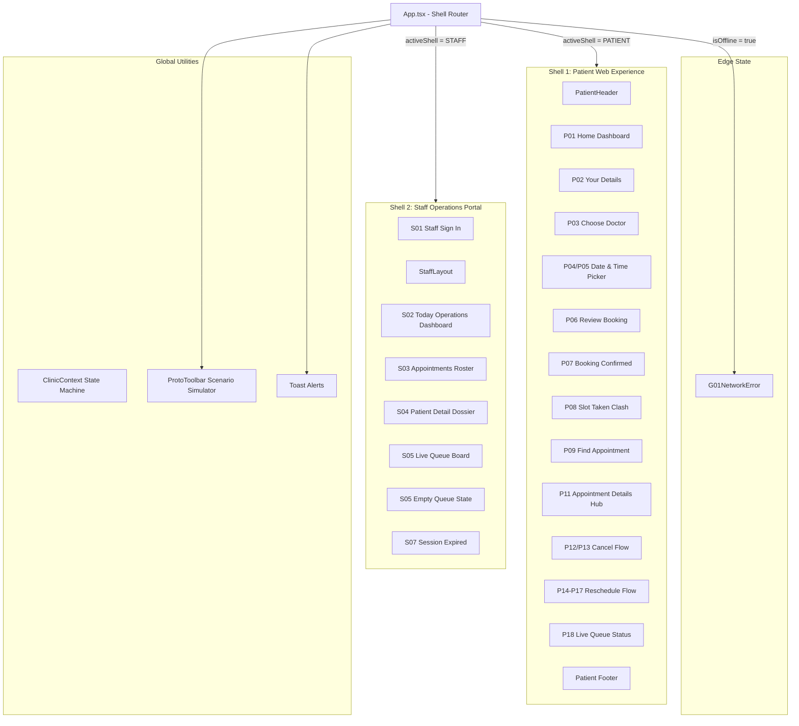

# YɛnCare — System Architecture & Technical Specification

This document provides a comprehensive technical overview of the YɛnCare platform architecture, component hierarchy, state management, data models, and screen state machines.

---

## 1. System Overview

YɛnCare is a clinic appointment booking and live virtual queue system designed for partner outpatient clinics in Ghana. It eliminates chaotic physical waiting rooms by providing:
1. **Patient Web Experience**: Frictionless booking, phone/reference lookup, and real-time live queue tracking without requiring account passwords.
2. **Staff Clinical Operations Portal**: Reception check-in, doctor consultation management, and real-time waiting corridor queue management.
3. **Clinical Brutalism Design System**: High-contrast, structured, editorial minimalism optimized for legibility, trust, low cognitive load, and accessibility.

---

## 2. Component Hierarchy & Flow



---

## 3. State Management (`ClinicContext`)

All application state is managed centrally via `ClinicContext` (`src/context/ClinicContext.tsx`), providing reactive updates across both shells.

### Key State Fields

| State Property | Type | Description |
|---|---|---|
| `activeShell` | `'PATIENT' \| 'STAFF'` | Currently displayed shell |
| `patientScreen` | `PatientScreen` | Active patient screen enum (`P01_HOME` ... `P18_QUEUE`) |
| `staffScreen` | `StaffScreen` | Active staff screen enum (`S01_SIGN_IN` ... `S07_SESSION_EXPIRED`) |
| `appointments` | `Appointment[]` | Live list of clinic appointments |
| `draftBooking` | `DraftBooking` | Temporary state for new patient booking flow |
| `rescheduleDraft`| `RescheduleDraft`| Temporary state for appointment rescheduling |
| `activePatientAppointmentId` | `string` | ID of patient viewing their details (default: `YC-4821`) |
| `selectedStaffAppointmentId` | `string` | ID of patient selected in staff roster |
| `staffUser` | `StaffUser` | Active staff profile (Abena Osei / Dr. Boateng / Kojo Mensah) |
| `isOffline` | `boolean` | Flag to trigger G01 network error scenario |
| `isSessionExpired` | `boolean` | Flag to trigger S07 session expired scenario |
| `simulateSlotTaken` | `boolean` | Flag to trigger P08 slot conflict scenario on submit |

---

## 4. Data Models (`src/types/clinic.ts`)

### `Appointment`
```typescript
interface Appointment {
  id: string;                      // e.g. "YC-4821" (speakable reference)
  patientName: string;             // e.g. "Ama Mensah"
  phone: string;                   // e.g. "024 123 4567"
  doctor: Doctor;                  // Attending clinician
  date: string;                    // e.g. "Tuesday 15 September 2026"
  time: string;                    // e.g. "10:00 AM"
  status: AppointmentStatus;       // 'BOOKED' | 'WAITING' | 'CALLED' | 'COMPLETED' | 'CANCELLED'
  queueToken?: string;             // e.g. "#4" (assigned upon reception check-in)
  estimatedWaitMinutes?: number;   // e.g. 30
  room?: string;                   // e.g. "Consultation Room 3"
}
```

### `Doctor`
```typescript
interface Doctor {
  id: string;
  name: string;                    // "Dr. Kwame Boateng"
  title: string;                   // "Senior Medical Officer"
  specialty: string;               // "General Practice & Outpatient"
  room: string;                    // "Consultation Room 3"
}
```

### `StaffUser`
```typescript
interface StaffUser {
  id: string;
  name: string;
  role: 'Receptionist' | 'Doctor' | 'Admin';
  clinic: string;                  // "[Partner clinic]"
}
```

---

## 5. Screen Navigation & State Machines

### Patient Journey
1. **P01 Home Dashboard**: Landing card with direct actions:
   - "Book an appointment" &rarr; `P02_DETAILS`
   - "Find my appointment" &rarr; `P09_FIND`
   - "Check queue" &rarr; `P18_QUEUE`
2. **P02 Your Details**: Full Name and Ghana phone number (+233).
3. **P03 Choose Doctor**: Single partner clinic doctor selection (`Dr. Kwame Boateng`).
4. **P04/P05 Date & Time Picker**: Combined calendar dates + 30-min time slot picker.
5. **P06 Review Booking**: Summary table + SMS advisory before confirmation.
6. **P07 Booking Confirmed**: Success screen displaying speakable code `YC-4821`.
7. **P08 Slot Taken**: Recovery state when a chosen slot was just taken by another patient.
8. **P09 Find Appointment**: Lookup by phone + reference code with validation for not-found states.
9. **P11 Appointment Details**: Management hub for checking status, rescheduling, or cancelling.
10. **P12/P13 Cancel Flow**: Cancellation confirmation prompt & completion screen.
11. **P14–P17 Reschedule Flow**: 3-step date & time selection, comparison review, and updated confirmation.
12. **P18 Live Queue Status**: 5-stage lifecycle stepper (`Booked` &rarr; `Checked in` &rarr; `Waiting` &rarr; `Called` &rarr; `Completed`), big `#4` token, and wait time guide.

### Staff Workflows
1. **S01 Sign In**: Staff login with quick demo role switcher (`Receptionist`, `Doctor`, `Admin`).
2. **S02 Today Operations**: Real-time counters (Total Bookings, Waiting, In Consultation, Completed) and roster preview.
3. **S03 Appointments Roster**: Searchable table by name/phone/reference with status filter tabs and distinct teal `Check In` action.
4. **S04 Patient Detail**: Clinical dossier with primary check-in/call action.
5. **S05 Live Queue**: Split-view queue board with currently called patient in Room 3 and waiting corridor table with one-click `Call` actions.
6. **S05 Empty Queue**: Clean empty state when no patients are waiting.
7. **S07 Session Expired**: Security timeout dialog with re-authentication.

---

## 6. Design System Architecture

The design system implements **Clinical Brutalism & High-Contrast Minimalism**:
- **Geometry**: Crisp, structured containers with intentional borders and minimal decoration.
- **Palette**:
  - Primary text / Action: `#111111`
  - Background: `#F7F8F7`
  - Surface: `#FFFFFF`
  - Secondary surface: `#F0F2F1`
  - Clinic Border: `#D8DCD9`
  - Input Border: `#C8CDCA`
  - Healthcare Accent: `#087F6C` (Clinical teal)
  - Soft Accent: `#E7F5F1`
  - Warning: `#B7791F` (`#FEF7ED` soft)
  - Error: `#C53030` (`#FDF2F2` soft)
- **Elevation**: Subtle, crisp shadow `0 2px 8px rgba(0,0,0,0.05)` applied to cards to prevent flatness without resorting to generic SaaS floating cards.
- **Typography**: Hanken Grotesk with deliberate weight hierarchy (regular 400 for body, medium 500 for secondary, semibold 600 for card headers/buttons, bold 700 for titles and queue numbers).

---

## 7. Backend SMS (`sendSms`)

The interactive prototype stores SMS rows in `ClinicContext` for the **Simulated SMS** viewer. That is UI-only.

Production Gate 2 confirmation texts use the Node wrapper in `backend/src/sms/sendSms.js`. Booking, persistence, and SMS send are three steps: write the appointment, return the speakable reference to the web client, then send SMS asynchronously from the server. **Booking success does not depend on SMS delivery.**

```
Patient books (web)
        │
        ▼
Express booking route
        │
        ├── MongoDB insert (Patient + Appointment + TimeSlot)
        ├── HTTP 201 + reference (YC-4821)
        └── sendSms(to, message)
                ├── SMS_PROVIDER=mock            → terminal log (offline)
                ├── SMS_PROVIDER=mnotify         → mNotify Quick SMS → real Ghana handset
                └── SMS_PROVIDER=africastalking  → AT sandbox → simulator inbox
```

Models, indexes, and `YC-XXXX` allocation: [`backend/docs/DATABASE_ARCHITECTURE.md`](../../backend/docs/DATABASE_ARCHITECTURE.md).

| Rule | Detail |
|---|---|
| Single API | Import `sendSms(to, message)` only. Do not call mNotify or Africa's Talking from route files. |
| Phone format | Ghana numbers are normalised to E.164 (`024 123 4567` → `+233241234567`). mNotify is sent the local form (`024…`). |
| Failures | Invalid phone throws. Provider errors return `{ ok: false }`. Missing live keys fall back to mock. |
| Live proof | mNotify delivers to a real Ghana phone (signup bonus / paid credits). |
| Secrets | `MNOTIFY_API_KEY` (and optional `AT_API_KEY`) live in `backend/.env` (gitignored). |

Full developer contract: [`backend/README.md`](../../backend/README.md).
